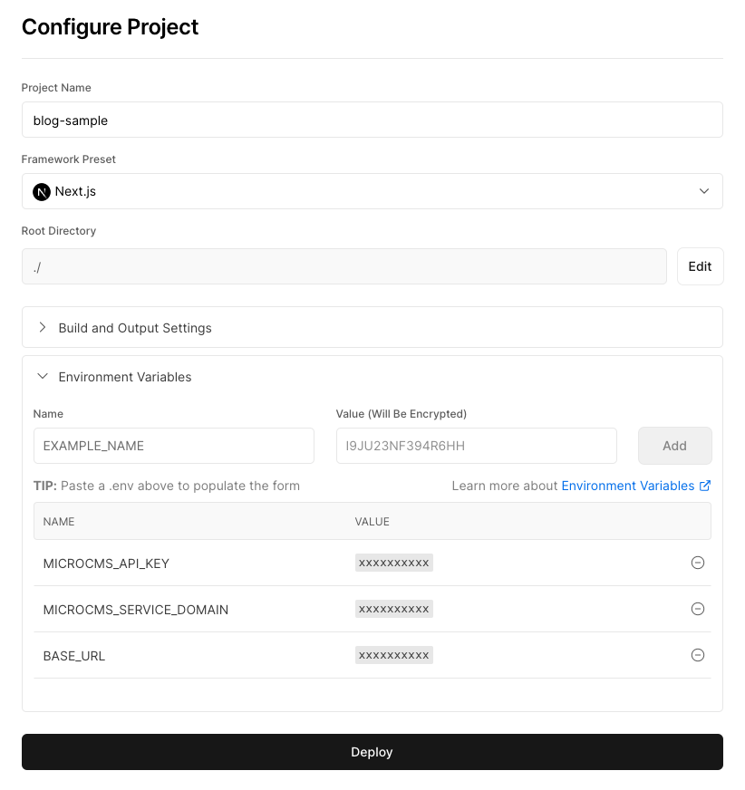

# Luminus


## 概要

microCMS Templates サービスを作成しています。

「シンプルなブログ」のテンプレートを独自にカスタマイズしたものです。
https://templates.microcms.io/templates/detail/a530e59f-d66d-4b85-9ef5-4cf4288adb09

## 動作環境

Node.js 18 以上

## 環境変数の設定

ルート直下に`.env`ファイルを作成し、下記の情報を入力してください。

```
MICROCMS_API_KEY=xxxxxxxxxx
MICROCMS_SERVICE_DOMAIN=xxxxxxxxxx
BASE_URL=xxxxxxxxxx
```

`MICROCMS_API_KEY`  
microCMS 管理画面の「サービス設定 > API キー」から確認することができます。

`MICROCMS_SERVICE_DOMAIN`  
microCMS 管理画面の URL（https://xxxxxxxx.microcms.io）の xxxxxxxx の部分です。

`BASE_URL`
デプロイ先の URL です。プロトコルから記載してください。

例）  
開発環境 → http://localhost:3000  
本番環境 → https://xxxxxxxx.vercel.app/ など

## 開発の仕方

1. パッケージのインストール

```bash
pnpm install
```

2. 開発環境の起動

```bash
pnpm dev
```

3. 開発環境へのアクセス  
   [http://localhost:3000](http://localhost:3000)にアクセス

## Vercel へのデプロイ

[Vercel Platform](https://vercel.com/new?utm_medium=default-template&filter=next.js&utm_source=create-next-app&utm_campaign=create-next-app-readme)から簡単にデプロイが可能です。

リポジトリを紐付け、環境変数を `Environment Variables` に登録後、デプロイしてみましょう。


